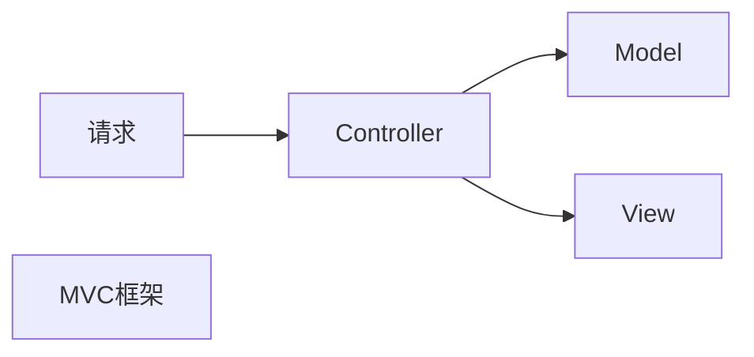
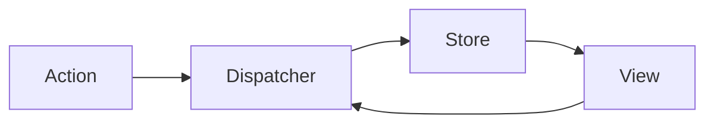

## 一堆 `Route` 和使用 `Switch` 包裹 `Route` 的区别

  `Switch` 呈现第一个包裹的 `<Route>` 或 `<Redirect>` 与该位置相匹配的孩子。
例子:

```jsx
<Route path="/about" component={About}/>
<Route path="/:user" component={User}/>
<Route component={NoMatch}/>
```

如果URL是/about，那么<About>，<User>并且<NoMatch>将全部呈现，因为它们全都匹配路径。

## 如何判断是state还是props：

它是通过 props 从父级传来的吗？如果是，他可能不是 state。
它随着时间推移不变吗？如果是，它可能不是 state。
你能够根据组件中任何其他的 state 或 props 把它计算出来吗？如果是，它不是 state。

## 如何确定你的 State 应该位于哪里

See the Pen Thinking In React: Step 4 by Kevin Lacker (@lacker) on CodePen.

好的，现在我们确定了应用 state 的最小集合。接下来，我们需要确定哪个组件会改变，或拥有这个 state。

记住：React 中的数据流是单向的，并在组件层次结构中向下传递。一开始我们可能不是很清楚哪个组件应该拥有哪个 state。在新手理解上这通常是最富有挑战性的部分，所以按照下面的步骤来辨别：

对你应用的每一个 state：

确定每一个需要这个 state 来渲染的组件。
找到一个公共所有者组件(一个在层级上高于所有其他需要这个 state 的组件的组件)
这个公共所有者组件或另一个层级更高的组件应该拥有这个 state。
如果你没有找到可以拥有这个 state 的组件，创建一个仅用来保存状态的组件并把它加入比这个公共所有者组件层级更高的地方。

## fetch

Fetch 是一个现代的概念, 等同于 XMLHttpRequest。它提供了许多与XMLHttpRequest相同的功能，但被设计成更具可扩展性和高效性。

> XMLHttpRequest 是一个 API，它为客户端提供了在客户端和服务器之间传输数据的功能。它提供了一个通过 URL 来获取数据的简单方式，并且不会使整个页面刷新。这使得网页只更新一部分页面而不会打扰到用户。XMLHttpRequest 在 AJAX 中被大量使用。

Fetch 的核心在于对 HTTP 接口的抽象，包括 Request，Response，Headers，Body，以及用于初始化异步请求的 global fetch。得益于 JavaScript 实现的这些抽象好的 HTTP 模块，其他接口能够很方便的使用这些功能。
Fetch API 提供了一个 JavaScript接口，用于访问和操纵HTTP管道的部分，例如请求和响应。它还提供了一个全局 fetch()方法，该方法提供了一种简单，合理的方式来跨网络异步获取资源。

fetch规范与jQuery.ajax()主要有两种方式的不同：(最后我用了axios,都差不多,但是现在axios是主流)

当接收到一个代表错误的 HTTP 状态码时，从 fetch()返回的 Promise 不会被标记为 reject， 即使该 HTTP 响应的状态码是 404 或 500。相反，它会将 Promise 状态标记为 resolve （但是会将 resolve 的返回值的 ok 属性设置为 false ），仅当网络故障时或请求被阻止时，才会标记为 reject。
默认情况下，fetch 不会从服务端发送或接收任何 cookies, 如果站点依赖于用户 session，则会导致未经认证的请求（要发送 cookies，必须设置 credentials 选项）。


在使用fetch或者axios向node后端 post json 数据时需要引入 body-parser中间件,否则body会显示 undefined,这是因为 express组件中已经分离了body-parser这个中间件 ,在引入body-parser中间件后还需要把 `app.use(bodyParser.json());` 写在路由配置之前

## 上传图片到服务器,并且返回文件的地址

前端用formdata发送头像到后端, 后端用了 multer 这个中间件来读取保存图片到服务器,如果头像上传成功,返回文件的名字

下面是前端的代码

```jsx
{/* action字段与server.js中的const upload = multer({ dest: 'upload/' }) 呼应 enctype必须设置为"multipart/form-data"才可以传输ormdata数据 */}
{/* 之后发现action似乎没什么作用,随意修改也不影响使用*/}
<form className="avatarForm" action="/upload"  enctype="multipart/form-data">
  <input type="file" name="file" id="avatarfile" onChange={()=>{this.handleAvatarChange()}}/>
</form>
```

下面是后端的nodejs代码

```javascript
const multer  = require('multer')
// 最终文件会保存在service/upload目录中
const upload = multer({ dest: 'upload/' })
// 此处的file为文件上传的input标签的name字段
app.post('/upimg', upload.single('file'),function(req,res){
  //这里写一些要返回的数据,比如返回保存后的文件名
}
```
## MVC框架的不足

MVC把应用分为三个部分:

Model(模型)负责管理数据,大部分业务逻辑放在Model中;

View(视图)负责渲染用户界面,应该避免在View中涉及业务逻辑;

Controller(控制器)负责接受用户输入,根据用户输入调用对应的Model部分逻辑,把生产的数据结果交给View部分,让View渲染出必要的输出.



这样的逻辑划分实质上把一个应用划分为多个组件,份而治之.相比把业务逻辑和页面渲染逻辑混在一起,MVC框架要先进的多,这种方式得到了广泛认可,Facebook醉蛛也是使用这种框架.

但是MVC很容易就会变得复杂起来,因为不同模块之间的依赖关系让系统变得"脆弱而不可预测"

由于在MVC框架中View可以和Model直接通信 ,所以会出现下图的情况


对于MVC框架,为了让数据可控,Controller应该是中心,当View要传递消息给Model时,应该调用Controller的方法,当Model要更新View时,也应该通过Controller引发新的渲染.

Flux的出现正是为了解决这个问题,Flux一个特点就是更严格的数据流控制.



Dispatcher用来处理动作分发,维持Store之间的依赖关系;

Store负责存储数据和处理相关逻辑

Flux带来的最重要的好处就是"单向数据流"的管理方式.

如果把Flux看做一种框架理念,Redux是Flux的一种实现,Redux在Flux"单向数据流"的基础上,强调三个基本原则:

- [ ] 唯 一数据源
- [ ] 保持状态只读
- [ ] 数据改变只能通过纯函数完成


